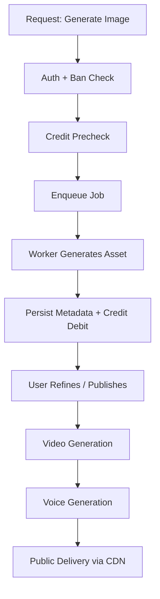

## Overview
Percify combines a Next.js application layer, specialized generation workers, and a PostgreSQL database for persistent entities (users, avatars, media metadata, credits). Object storage (GCS/S3 compatible) is used for generated media assets. A unified credit system mediates feature access and billing.

## Core Components

| Component | Purpose | Tech |
|-----------|---------|------|
| Web App | User dashboard & Studio UX | Next.js (App Router), React, Tailwind |
| Admin App | Moderation, system ops | Next.js + role gating |
| Docs App | Public product docs | Mintlify MDX site |
| API Routes | Feature endpoints (image/video/audio) | Next.js Route Handlers |
| Generation Workers | Offloaded heavy model inference | Provider APIs / Background queues |
| PostgreSQL | Relational data (users, avatars, credits) | Managed Postgres |
| Object Storage | Media asset persistence | GCS / CDN |
| Credit Engine | Centralized cost logic | `credit-costs.ts` |
| Ban System | Safety enforcement | `ban-check.ts`, DB columns |

## Data Flow: Image → Video → Voice
1. User submits image prompt (POST /images/generate)
2. Credits pre-authorized; job enqueued
3. Worker/model returns image asset → metadata saved
4. User requests video (POST /videos/from-image) referencing imageId
5. Duration cost calculated (base + perSecond)
6. Optional voice generation; audio asset linked
7. Composite published (visibility rules applied)

## Credit Calculation
Central file (`src/lib/credit-costs.ts`) exports:
- `getFeatureCost(feature)` simple lookups
- `calculateVideoCost(durationSeconds, type)` base + incremental
- `calculateAudioCost(durationSeconds)` duration metering
Future expansion: tier overrides in `TIER_COSTS` map.

## Safety & Moderation
- Ban columns on `user` table: `banned`, `banned_at`, `banned_reason`
- Middleware/utility `requireNotBanned(userId)` used across write endpoints
- Private vs public visibility flags for avatars/videos
- Rate limiting (not shown here) recommended at API gateway level

## Performance Patterns
- Consolidated COUNT aggregation using filtered UNION strategy for dashboard metrics
- Targeted indexes for feed/explore & dashboard queries (see Performance page)
- Caching: CDN + stale-while-revalidate for feed endpoints

## Extensibility
Add new generation feature:
1. Define costs in `FeatureCosts`
2. Implement route handler with pre-check (auth + ban + credits)
3. Store metadata row, emit event for async post-processing
4. Expose retrieval endpoint & add to docs navigation

## High-Level Sequence (Pseudo)

## Environment Separation
| Env | Purpose | Notes |
|-----|---------|-------|
| Development | Local iteration | Test credits & mock providers |
| Staging | Pre-prod validation | Lower model concurrency |
| Production | Live users | Full observability + alerts |

## Observability (Recommended)
- Structured logs around generation timings & credit debits
- Slow query detection with threshold logging (>500ms)
- Endpoint latency percentiles to tune caching

## Future Improvements
- Tier-based dynamic pricing
- Materialized views for extreme high-volume dashboards
- Event-driven webhook emission on asset lifecycle
- Quota vs credit hybrid for enterprise plans

---
For detailed performance tactics see [/percify/performance].
